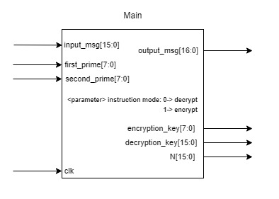
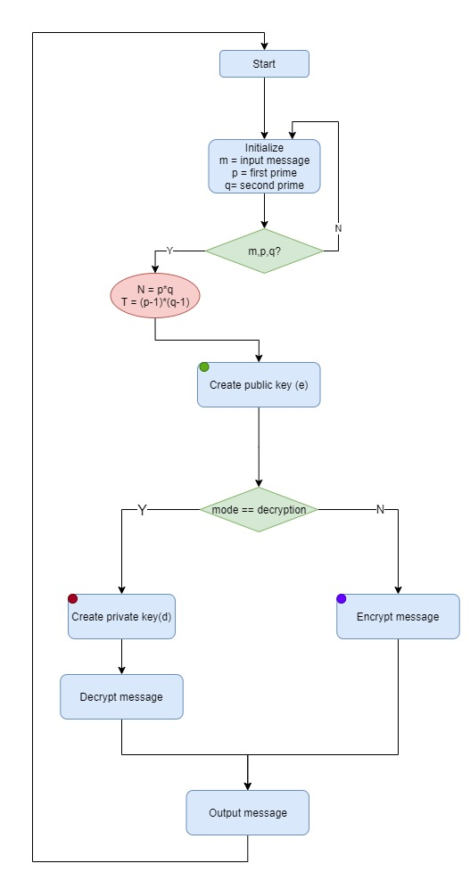

# RSA-Verilog
[RSA](https://simple.wikipedia.org/wiki/RSA_algorithm) implementation in verilog to Encrypt/Decrypt 16-bit input messages using two prime numbers `p` and `q` both 8-bits.

## Brief
RSA (Rivest–Shamir–Adleman) is an algorithm used by modern computers to encrypt and decrypt messages. It is an asymmetric cryptographic algorithm. Asymmetric means that there are two different keys. This is also called public key cryptography, because one of the keys can be given to anyone. The other key must be kept private. The algorithm is based on the fact that finding the factors of a large composite number is difficult: when the factors are prime numbers, the problem is called prime factorization. It is also a key pair (public and private key) generator.


## RSA in action
In file encryption the file is encrypted symmetrically and the key is encrypted by RSA directly.

For Digital signatures one can use the private key to sign a message or file (or better: sign the cryptographic hash of the message/file). If a second party has the corresponding public key he can verify that the file is authentic and has not been altered or damaged.

## Implementation
Main module schematic


parameter `instruction_selctor` is given while instantiating main module to select whether encryption or decryption mode.

there are some intermediate I/Os to synchronize components too.

>Arithmetic challenge: encryption/decryption requires math power function and `M**e` / `M**d` requires larger register so in each `mpower = mpower mod N` is calculated and then its multiplied by `M`. psuedo code shows the solution.
```python
#Ordinary way
mpower = 1
for _ in range(d):
    mpower = mpower * M
remainder = mpower % N
#Solution
mpower = 1
for _ in range(d):
    mpower = mpower % N
    mpower = mpower * M
remainder = mpower % N   
```
## Usage


## Diagrams
